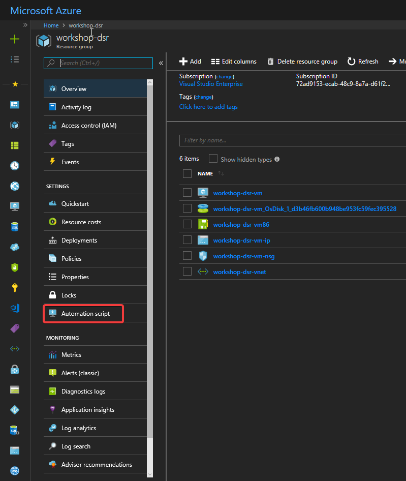
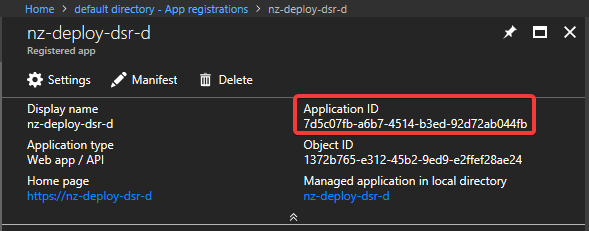
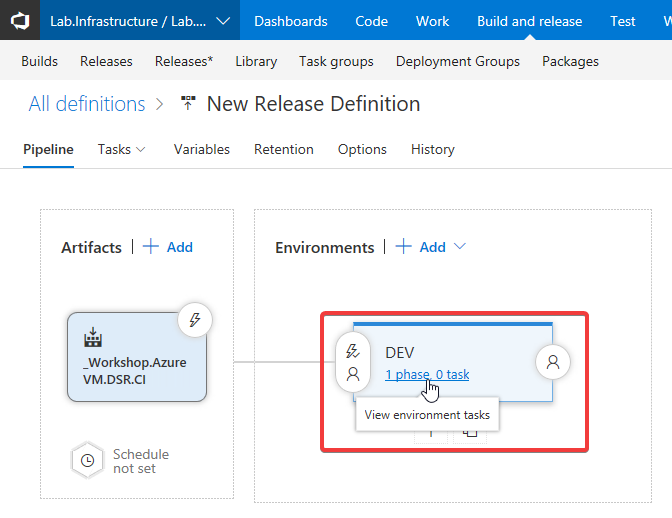

# Delivering Azure Infrastructure using Code and Modern Development Practices

This session will show you how to create a continuous delivery
pipeline that will deploy an Azure Virtual Machine.

**Daniel Scott-Raynsford**

_Continuous Delivery Practice Lead, IAG NZ_

[Microsoft Cloud and Datacenter MVP](https://mvp.microsoft.com/en-us/PublicProfile/5002340?fullName=Daniel%20%20Scott-Raynsford) | [@dscottraynsford](https://twitter.com/dscottraynsford) | [Linked-In](https://www.linkedin.com/in/dscottraynsford/) | [Email](mailto:dscottraynsford@outlook.com) | [GitHub](https://www.github.com/PlagueHO)

## Content

- [What You Will Need](#what-you-will-need)
- [Prerequisite Knowledge](#prerequisite-knowledge)
- [What You Will Learn](#what-you-will-learn)
- [Part 1 - Create an Azure VM using the Azure Portal](#part-1---create-an-azure-vm-using-the-azure-portal) - 15 min
- [Part 2 - Create a VSTS Git Repository](#part-2---create-a-vsts-git-repository) - 5 min
- [Part 3 - Clone the Repository](#part-3---clone-the-repository) - 5 min
- [Part 4 - Export Azure Resource Manager Template for VM](#part-4---export-azure-resource-manager-template-for-vm) - 5 min
- [Part 5 - Delete your Azure Resource Group](#part-5---delete-your-azure-resource-group) - 5 min
- [Part 6 - Create your VSTS Build Defintion](#part-6---create-your-vsts-build-defintion) - 15 min
- [Part 7 - Commit your First Repository Change](#part-7---commit-your-first-repository-change) - 5 min
- [Part 8 - Create a VSTS Service Principal](#part-8---create-a-vsts-service-principal) - 15 min
- [Part 9 - Create VSTS Service Endpoint for Azure](#part-9---create-vsts-service-endpoint-for-azure) - 5 min
- [Part 10 - Create VSTS Release Pipeline](#part-10---create-vsts-release-pipeline) - 15 min
- [Part 11 - Fix the Azure Resource Manager Template](part-11---fix-the-azure-resource-manager-template) - 10 min

Estimated workshop time: 120 min
Estimated Azure credit usage: USD 1.00 (as long as you delete
the infrastructure straight after completion of the workshop)

## Prerequisite Knowledge

- Basic knowledge of Compute and Virutalization (Hyper-V or VMWare or Cloud compute)
- Basic knowledge of using text based consoles (CMD or PowerShell)

## What You Will Learn

You'll learn the basics in the following skills:

- Git (the very basics)
- VSTS Repositories
- VSTS Builds
- VSTS Releases
- VSTS Service Endpoints
- Azure Virtual Machines
- Azure Virtual Machine Extensions (DSC)
- Azure VNET and NSG
- Azure Service Principals
- Azure Resource Manager Templates

## What You Will Need

To complete this workshop you'll need the following:

- A **Microsoft Azure Account**
  _You can sign up for a free trial [here](https://azure.microsoft.com/en-us/free/)_
- A **Windows 10** computer with the following tools installed:
  - [Git](https://git-scm.com/downloads), v2.17+
  - [Visual Studio Code](https://code.visualstudio.com/download), v1.24+, with these extensions:
    a. Azure DevOps Extension for Visual Studio Code
    b. PowerShell
    c. Azure Resource Manager Tools
    d. Azure Account
  - [Windows PowerShell 5.1](https://www.microsoft.com/en-us/download/details.aspx?id=54616) - Comes with Windows 10, but just in case...
    _Yes, PowerShell Core 6.0 would also work... go on,be brave, git it a try_
- **Project Administrator** access to a project in project in Azure DevOps.

## Part 1 - Create an Azure VM using the Azure Portal

We'll create a publically accessible Virual Machine in Azure using the Azure Portal.
The **Virtual Machine** will be created inside a **Virtual Network** with a **Network
Adapter** assigned a **Public IP** address. A **Network Security Group** will be
attached to the **Virtual Network** to filter traffic to the Virtual Machine.

1. Download the DSC files that will install Windows Admin Center on the VM:
  [DSC Windows Adin Center](https://github.com/PlagueHO/Workshop-AzureDevOps-Infrastructure/raw/master/dsc/dscfiles.zip)
2. Open the [Azure Portal](https://portal.azure.com) in a browser.
  [https://portal.azure.com](https://portal.azure.com)
3. Log in to the Azure Portal.
4. Once the portal opens, enter `Windows Server 2016` in the search box:

    

5. Select **Windows Server 2016 Datacenter** from the **Marketplace**.
6. Click **Create**.
7. Configure the Virtual Machine **Basic Settings** like this:
    - Name: `workshop-<your initials>-vm`
    - VM disk type: `SSD`
    - Username: `<your first name>` - don't use Admin or Administrator.
    - Password: `<A complex password>`
    - Resource Group: `Create New` Name: `workshop-<your initials>`
    - Location: `West US 2` - We would normally use AU, but US is cheaper
      and some free Azure Accounts don't allow provisioning VMs in AU.

    

8. Click **OK**.
9. Select a VM size (suggest `D2s_v3`):

    

10. Configure the Virtual Machine **Settings** like this:
    - High Availability: `None`
    - Availability Set: `None`
    - Storage: `Use Managed Disks is Yes`
    - Virtual Network: `workshop-<Your Initials>-vnet`
    - Subnet: `default (172.16.0.0/24)`
    - Public IP Address: `workshop-<Your Initials>-vm-ip`
    - Network Security Group: `Basic`
    - Select Public Inbound Ports: `Enable HTTPS`
    - Extensions: See next step for details
    - Auto-Shutdown: `Off`
    - Boot Diagnostics: `Disabled`
    - Guest OS Diagnostics: `Disabled`
    - Register with Azure Active Directory: `No`
    - Backup: `Disabled`

11. The DSC extension needs to be added to the VM. Click **Extensions**.
12. Click **Add Extension**.
13. Select **PowerShell Desired State Configuration**.
14. Click **Create**:

    

15. Configure the DSC Extension like this (note, this won't actually work):
    - Configuration Modules or Script: Select the `dscfiles.zip` downloaded in step 1.
    - Module-qualified Name of Configuration: `DSCConfiguration.ps1\WindowsAdminCenter`
    - WMF Version: `latest`
    - Version: `2.76`
    - Auto Upgrade Minor Version: `Yes`

    

16. Click **OK**.
17. Click **OK** on the Extensions blade.
18. Click **OK** on the Setting blade.
19. Click **Create** once validation has passed.

Your **Virtual Machine** and supporting infrastructure will now be provisioned.


| Note: the DSC will fail because the DSC extension actually requires a URL for the
`Configuration Modules or Script` setting. We'll be fixing this up in the Azure
Resource Manager in the Git repository.

## Part 2 - Create a Azure DevOps Repository

We will use a Git repository hosted in Azure DevOps
to store all the files we create in this workshop.

This will be created in the Azure DevOps project you're using to run this workshop:

1. Open the Azure DevOps Project in your browser.
2. Expand the **Code** menu and select **Manage Repositories**.

    

3. Click **New Repository**.
4. Enter the name `Workshop.AzureVM.**\<Your Initials\>**` for the
   new repository.
5. Tick **Add a name for your Git repository**.
6. Select **VisualStudio** in the **Add a .gitignore** dropdown box.

    

7. Click **Create**.

    

Your repository has now been created and you can **Clone** and start
using it to version control files.

## Part 3 - Clone the Repository

Now that the Azure DevOps **remote** repository has been created we need to **clone**
the repository to your computer (called a **local** copy). This allows you to
add files and commit new versions to our **local** repo and then **push** (a.k.a.
sync) all the changes to the **remote** repository (in Azure DevOps).

We will use the **Git** Client software to manipulate Git repositories, both
locally and remotely. There are GUI tools available that can make this easier,
but it is recommended that you learn the **Git** client.

A good understanding of Git is an essential skill that **all technology
professionals** will need in the future. Using only the GUI prevents you
from becomming a...


It also prevents automation which is also essential with Git.

1. Open your Azure DevOps Project in a browser.
2. Expand the **Code** menu and select **Files**.
3. Select the **Repository** menu (shows **Workshop.Infrastructure) and select
  the repository you created in the previous Part `Workshop.AzureVM.\<Your Initials\>`:

    

4. Click the **Clone** button at the top right:

    

5. Click the **copy** button to the right of the HTTPS URL:

    

6. Run **Git CMD** in the **Start Menu**:

    

7. It is recommended to change to a folder that you will store repositories in:

```cmd
cd Source
```

8. Enter the Git command `git clone` and paste the git clone URL copied earlier:

```cmd
git clone <Your clone URL>
```

| Note: If you run into an error this is likely caused by the proxy. You will need
to resolve this using one of the methods in Confluence. E.g.

```cmd
git clone -c http.proxy="https://devproxy.ldstatdv.net:81" <Your clone URL>
```

9. You may get asked to login to Azure DevOps.

    

10. Your repository will then be cloned into a subfolder matching the name of
  the Azure DevOps respository you created:

    

You have now cloned a **local** copy of the remote Azure DevOps repository into a subfolder.

You can now add files to this **local** repository and **commit** changes. Each set of
changes you make to the files in this repository can be **committed** as a new version
of the files. This is the essence of a version control system. The **local** repository
can then be **pushed** back to the **remote** repository in Azure DevOps.

## Part 4 - Export Azure Resource Manager Template for VM

Now that the VM has been provisioned we can export it as an Azure Resource Manager
Template.

1. Open the [Azure Portal](https://portal.azure.com) in a browser.
  [https://portal.azure.com](https://portal.azure.com)
2. Log in to the Azure Portal.
3. Once the portal opens and search for the resoruce group by entering
  `Workshop-<Your Initials>` in the search box:

    

4. Select the Resource Group `Workshop-<Your Initials>`.
5. Select `Automation Script` from the **Resource Group** blade:

    

6. Click `Download` to download the ARM template.

    

7. Download the zip file into a folder called `infrastructure` in your **Repository**.
8. Unzip the zip file that was downloaded into the `infrastructure` folder (don't put it in a subfolder)
9. Delete the downloaded zip file. You should have a folder looking like this:

    

We now have all the files required to rebuild our Virtual Machine using
automation only.

## Part 5 - Delete your Azure Resource Group

So that we can redeploy the Virtual Machine using the ARM template and a CI/CD pipeline
we need to delete the resource group.

1. Open the [Azure Portal](https://portal.azure.com) in a browser.
  [https://portal.azure.com](https://portal.azure.com)
2. Log in to the Azure Portal.
3. Once the portal opens and search for the resoruce group by entering
  `Workshop-<Your Initials>` in the search box:

    

4. Select the Resource Group `Workshop-<Your Initials>`.
5. Click **Delete Resource Group**.
6. Enter the name of the resource group `Workshop-<Your Initials>`

    

7. Click **Delete**.

It will take a few minutes for your Resource Group to be deleted but
we'll move onto the next step while this happens.

## Part 6 - Create your Azure DevOps Build Defintion

This will be created in the Azure DevOps Project project.

1. Open your Azure DevOps Project in a browser.
2. Select the **Build and Release** menu and select **Builds**.
3. Click the `+New` button to create a new Build Definition.

    

4. Select a Source of `Azure DevOps Git`.
5. Set the **Team project** to `<the name of your Azure DevOps project>`.
6. Set the **Repository** to the repository you created in Part 2 (e.g. `Workshop.AzureVM.<Your Initials>`).
7. Set the **Default branch for manual and scheduled builds** to `Master`.
8. Click **Continue**.
9. Click **Empty Process**.
10. In the **Agent Queue** select `Hosted 2017`.
11. Edit the name of the build to `Workshop.AzureVM.<Your initials>.CI`:

    

12. Click the `+` button on **Phase 1**.
13. Search for the **Publish Build Artifacts** task and click `Add`:

    

14. Click the new **Publish Artifact** task.
15. Set the **Publish Artifact** task parameters to:

    - Display Name: `Publish Artifact: infrastructure`
    - Path to Publish: `infrastructure`
    - Artifact Name: `infrastructure`
    - Artifact publish location: `Azure DevOps/TFS`

    

16. Click the **Triggers** tab.
17. Tick **Enable continuous integration** (this is what CI means):

    

18. Select **Save** from the **Save & Queue** menu to save the build.

    

19. Enter `\Workshop.AzureVM` into the **Select Folder** box:

    

The build definition is now complete and will occur every time a change to master
branch occurs.

## Part 7 - Commit your First Repository Change

1. Run **Git CMD** in the **Start Menu**:

    

2. Change to the folder you cloned your repository into:

```cmd
cd Source\Workshop-AzureDevOps-Infrastructure
```

3. Mark all new files to be added to the repository (the infrastructure
  definitions created in the earlier part):

```cmd
git add .
```

4. Commit all the marked files as a new version:

```cmd
git commit -m "Added infrastructure definition"
```

5. Push (sync) all commits and changes to the **Remote Repository**

```cmd
git push
```

| Note: If you run into an error this is likely caused by the proxy. You will need
to resolve this using one of the methods in Confluence. E.g.

```cmd
git push -c http.proxy="https://devproxy.ldstatdv.net:81"
```


Your first commit will be pushed to the **Remote Repository** master branch in
VSTS. This will also trigger your CI (Build Definition) to trigger.


Welcome to your first successful Continuous Integration.

| Important Note: When you're doing this for real, you'd actually use a
**Branch** and work off that, making a **Pull Request** to merge to master
and requesting a code review from a fellow technology professional.
This helps prevent bugs as well as reducing the risk of malicious code
being put in production.

## Part 8 - Create a VSTS Service Principal

Whenever we need to automate something in Azure, we need to use a
**Service Principal** account because using a User account for
automation is never advisable (or usually even possible).

The **Service Principal** we create will be used to allow VSTS to deploy
the new Azure VM to your Azure subscription. We will need to grant
the Service Principal **Contributor** access to the **Subscription**.

There are four elements that make up a Service Principal. We'll need
to generate and record each of these:

- Application ID
- Application Key
- Subscription ID
- Tenant ID

We'll also record the Subscription Name.

The following process will help you generate and record these values:

1. Open the [Azure Portal](https://portal.azure.com) in a browser.
  [https://portal.azure.com](https://portal.azure.com)
2. Log in to the Azure Portal.
3. Enter `Active Directory` in the Azure Search box:

    

4. Click the **Active Directory** Service.
5. Select **App Registrations** from the default directory blade:

    

6. Click `New application registration`.
7. Enter:
    - Name: `nz-deploy-<your initials>-d`
    - Signon URL: `https://nz-deploy-<your initials>-d`

    

8. Select **App Registrations** from the default directory blade again.
9. Find the new **App Registration** that was created by entering
  `nz-deploy-<your initials>-d` and selecting **All Apps**:

    

10. Click the `nz-deploy-<your initials>-d` service principal.
11. Record (Copy/Paste) the **Application ID**:

    

12. Click **Settings**.
13. Click **Keys**.
14. Enter `workshop` in the Description of a new password and specify **1 Year** in Expires:

    

15. Click **Save**.
16. Record (Copy/Paste) the Value - this is the **Application Key**:
17. Enter `Active Directory` in the Azure Search box:

    

18. Click the **Active Directory** Service.
19. Select **Properties** from the default directory blade again.
20. Record (Copy/Paste) the **Directory ID** - this is the **Tenant ID**:

    

21. Enter `Subscription` in the Azure Search box:

    

22. Click the **Subscriptions** Service.
23. Click the **Subscription** you're going to allow VSTS to deploy to.
24. Record (Copy/Paste) the **Subscription ID**.
25. Record (Copy/Paste) the **Subscription Name**.

    

26. Select **Access Control (IAM)**.
27. Click **+ Add**.
28. Set **Role** to `Contributor`.
29. Set **Select** to `nz-deploy-<Your Initials>-d`.
30. Click the `nz-deploy-<Your Initials>-d`.
31. Click **Save**.

    

You are now ready to allow VSTS to deploy to your Azure account on your
behalf. You should have ended up with 5 recorded settings:


## Part 9 - Create Azure DevOps Service Endpoint for Azure

To allow Azure DevOps to deploy the VM to our Azure (free) subscription we
need to create a Azure DevOps Service Endpoint. We will

1. Open your Azure DevOps Project in a browser.
2. Select **Services** from the Project Settings menu:

    

3. Click **New Service Endpoint** and select **Azure Resource Manager**:

    

4. Click **use the full version of the endpoint dialog**:

    

5. Complete the dialog using the values you collected from Part 8:
    - Connection name: `sve-workshop-<Your Initials>-d`
    - Environment: `AzureCloud`
    - Subscription ID: the **Subscription Id** from Part 8
    - Subscription Name: the **Subscription Name** from Part 8
    - Service Principal Client ID: the **Application ID** from Part 8
    - Service Principal Key: the **Application Key** from Part 8
    - Tenant ID: The **Tenant ID** from Part 8

    

6. Click **Verify connection**.
7. Click **OK**.

You are now ready to be able to create a release pipeline.

## Part 10 - Create VSTS Release Pipeline

Infrastructure (and software) deployments are performed via a VSTS
Release Pipeline.

1. Open your Azure DevOps Project in a browser.
2. Select the **Build and Release** menu and select **Releases\***.
3. Click the `Create Release Definition` button to create a new Release Definition.

    

4. Select **Empty pipeline**.
5. Enter **DEV** for the environment name:

    

6. Set the release name to `Workshop.AzureVM.<Your Initials>`

    

7. Click `+Add artifact`.
8. Set the Artifact settings to:
    - Project: `Lab.Infrastructure`
    - Source (Build Definition): `Workshop.AzureVM\Workshop.AzureVM.<Your Initials>.CI`
    - Default Version: `Latest`
    - Source alias: `_Workshop.AzureVM.DSR.CI`

    

9. Click **Add**.
10. Click Lighting Bolt to the top right of the Artifact (continuous
  deployment trigger).

    

11. Enable **Continuous deployment trigger**.
12. Click **Add** for a new Branch Filter.
13. Select `master` in the **Build Branch**:

    

14. Click the `x phase, y tasks` link in the DEV environment:

    

15. Click the `+` button on **Phase 1**.
16. Search for `Azure Resource Group Deployment` and click **Add**:

    

17. Select the new Azure Deployment task:

    

18. Configure the release task with the following settings:
    - Azure subscription: `sve-workshop-<Your Initials>-d`
    - Action: `Create or update resource group`
    - Resource Group: `workshop-<Your Initials>`
    - Location: `West US 2`
    - Template Location: `Linked artifact`
    - Template: `$(System.DefaultWorkingDirectory)/_Workshop.AzureVM.<Your Initals>.CI/infrastructure/template.json` - Click the ... and naviagate to the `template.json` in the Infrastructure folder.

    

19. Click **Save**.
20. Enter `\Workshop.AzureVM` into the **Select Folder** box:

    

21. Click **OK**.

You have now created a **continuous delivery pipeline** to be able to deploy
changes to this Virtual Machine any time a new commit occurs to the **master**
branch of the **Remote Repository**

## Part 11 - Fix the Azure Resource Manager Template

What you may not know is that the ARM template extracted earlier actually contains some
problems that must be resolved before it can be deployed. To fix it up:

1. Edit the `infrastructure\template.json` file in the **Local Repository**.
2. Remove the `virtualMachines_workshop_dsr_vm_id` parameter by deleting it:

    

3. Delete the `id` parameter from the `osDisk` be deleting it:

    

4. Change the `ModulesUrl` setting to `https://github.com/PlagueHO/Workshop-AzureDevOps-Infrastructure/raw/master/dsc/dscfiles.zip`:

    

5. Change the `osProfile` object and add the `adminPassword` attribute:

    

| Note: This will cause the admin password to be a randomly generated string
so it will be impossible to login to this machine. This is why the DSC
configuration is critical. But because `Windows Admin Center` requires
the Administrator login to authenticate, so unfortunately you'll not be
able to login to the Windows Admin Center.

6. Save the `infrastructure\template.json`.
7. Run **Git CMD** in the **Start Menu**:

    

8. Change to the folder you cloned your repository into:

```cmd
cd Source\Workshop-AzureDevOps-Infrastructure.DSR
```

9. Mark all new files to be changed in the repository (the infrastructure
  definitions created in the earlier part):

```cmd
git add .
```

9. Commit all the marked files as a new version:

```cmd
git commit -m "Updated infrastructure definition"
```

10. Push (sync) all commits and changes to the **Remote Repository**

```cmd
git push
```

| Note: If you run into an error this is likely caused by the proxy. You will need
to resolve this using one of the methods in Confluence. E.g.

```cmd
git push -c http.proxy="https://devproxy.ldstatdv.net:81"
```


This commit will trigger a build, which if successful will then trigger a release.
The release will deploy a new copy of your Virtual Machine to your Azure Subscription.
